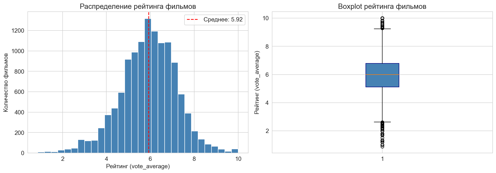
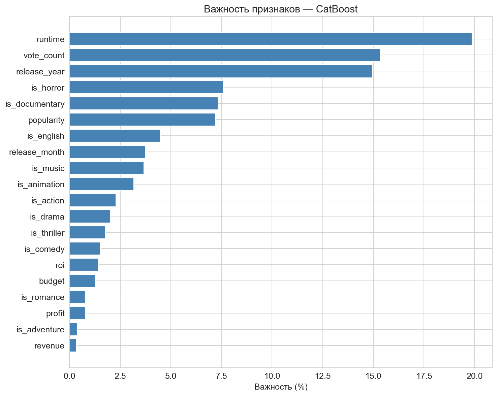
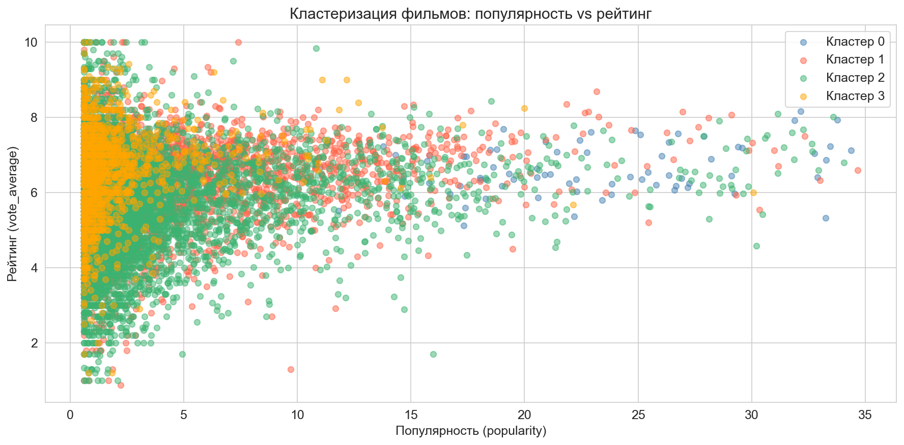
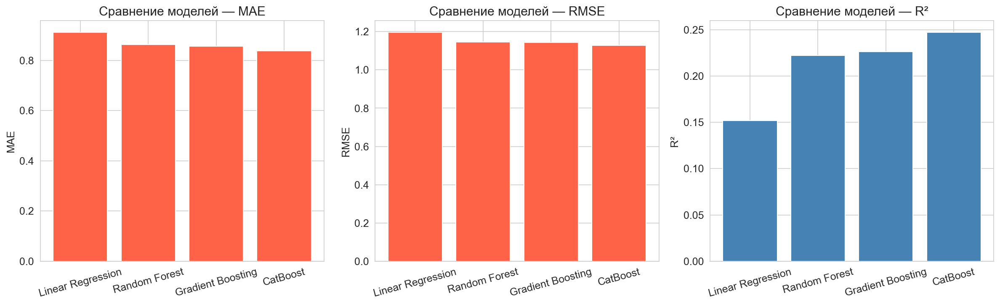

# Предсказание зрительского рейтинга фильма

> Анализ датасета TMDB (1M+ фильмов): кластеризация сегментов кинорынка и построение моделей машинного обучения для прогнозирования зрительской оценки.

---

## О проекте

Киноиндустрия ежегодно вкладывает миллиарды долларов в производство фильмов, однако зрительский успех остаётся непредсказуемым. Высокий бюджет не гарантирует высокий рейтинг — и наоборот.

В этом проекте я исследую, **какие характеристики фильма реально влияют на зрительскую оценку**, и строю модель, способную предсказать рейтинг по доступным данным.

**Задачи проекта:**
- Выявить факторы, коррелирующие с зрительским рейтингом
- Сегментировать фильмы на группы методом кластеризации
- Сравнить несколько ML-моделей и выбрать лучшую

---

## Результаты

### Лучшая модель — CatBoost

| Модель | MAE | RMSE | R² |
|---|---|---|---|
| Linear Regression | 0.9127 | 1.1971 | 0.152 |
| Random Forest | 0.8639 | 1.1465 | 0.222 |
| Gradient Boosting | 0.8573 | 1.1435 | 0.226 |
| **CatBoost** | **0.8380** | **1.1278** | **0.247** |

### Ключевые находки

- **Длительность фильма (runtime)** — самый важный предиктор рейтинга (20% важности в CatBoost). Более длинные фильмы чаще относятся к серьёзным жанрам с высокими оценками
- **Количество оценок (vote_count)** — чем больше людей оценило фильм, тем предсказуемее его рейтинг (15.5%)
- **Год выхода (release_year)** — вкусы аудитории и стандарты оценки меняются со временем (15%)
- **Бюджет и сборы** — практически не влияют на рейтинг (менее 2% важности каждый)
- **Жанр** — документальные фильмы и музыкальные получают рейтинг выше среднего, хоррор — ниже всех

### Сегменты кинорынка (K-Means, k=4)

| Кластер | Рейтинг | Бюджет | Популярность | Описание |
|---|---|---|---|---|
| 0 | 6.56 | ~19 тыс. $ | 2.1 | Малобюджетное кино с высоким рейтингом |
| 1 | 6.63 | ~1.6 млн $ | 4.5 | Независимое кино |
| 2 | 5.78 | ~1.1 млн $ | 4.2 | Основная масса фильмов |
| 3 | 6.58 | ~75 млн $ | 281.0 | Блокбастеры |

---

## Структура репозитория

```
tmdb-movie-rating/
├── data/
│   └── .gitkeep              # папка для датасета (CSV не включён)
├── images/
│   └── ...
├── notebooks/
│   └── movie_rating.ipynb    # основной ноутбук
├── README.md
├── requirements.txt
└── .gitignore
```

## Стек технологий

| Инструмент | Назначение |
|---|---|
| Python 3.10+ | Основной язык |
| pandas | Обработка и анализ данных |
| numpy | Численные вычисления |
| matplotlib, seaborn | Визуализация |
| scikit-learn | ML-модели, кластеризация, метрики |
| CatBoost | Градиентный бустинг (лучшая модель) |
| Jupyter Notebook | Среда разработки |

---

## Данные

**Источник:** [Full TMDB Movies Dataset 2024](https://www.kaggle.com/datasets/asaniczka/tmdb-movies-dataset-2023-930k-movies) — Kaggle, автор asaniczka

**Объём:** ~1 000 000 фильмов, для анализа использована случайная выборка 100 000 записей (`random_state=42`)

**Целевая переменная:** `vote_average` — средний зрительский рейтинг по шкале 0–10

**Ключевые признаки после предобработки:**

| Признак | Описание |
|---|---|
| `runtime` | Длительность в минутах |
| `vote_count` | Количество зрительских оценок |
| `release_year` | Год выхода |
| `popularity` | Индекс популярности TMDB |
| `budget` / `revenue` | Бюджет и кассовые сборы |
| `is_horror`, `is_documentary` и др. | Бинарные жанровые признаки |
| `roi` | Рентабельность инвестиций |

---

## Графики

<table>
<tr>
<td><br><em>Распределение рейтинга</em></td>
<td><br><em>Важность признаков (CatBoost)</em></td>
</tr>
<tr>
<td><br><em>Кластеры фильмов</em></td>
<td><br><em>Сравнение моделей</em></td>
</tr>
</table>

---

## Выводы и дальнейшие направления

**Почему R²=0.247 — это нормально:**
Зрительский рейтинг — субъективная оценка, которая зависит от сценария, актёрской игры, маркетинга и личных предпочтений зрителей. Данные признаки (бюджет, жанр, длительность) объясняют лишь часть вариации — и это соответствует природе задачи.

**Что можно улучшить:**
- Добавить данные о режиссёре и актёрском составе
- Использовать NLP для анализа синопсиса фильма
- Подключить данные о критических оценках (Rotten Tomatoes, Metacritic)
- Попробовать нейронные сети на постерах фильмов

---

## Автор

**Мишанов Максим** — Финансовый университет при Правительстве РФ
